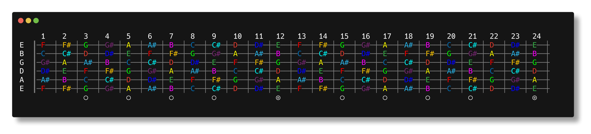
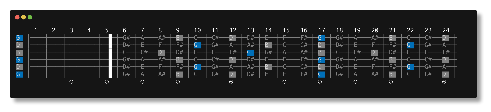
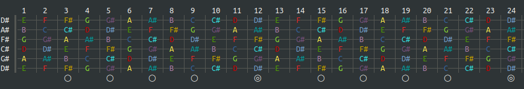
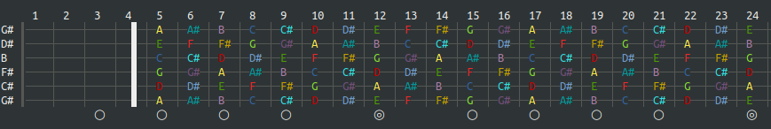
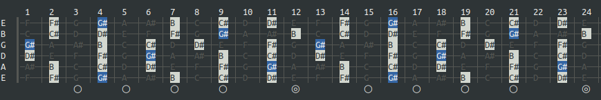
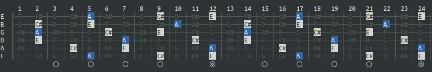
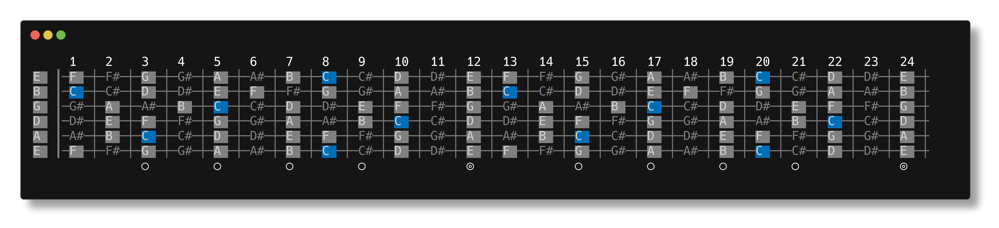

# 🎸 Jimi

A command line utility written in Go to display guitar fretboard, scales and chords in any tuning.

Because I love Go, CLIs and guitar (and Hendrix obviously!)

## Build

[](https://github.com/maximegosselin/jimi/actions/workflows/go.yml)

Jimi does not require any specific package or dependency and can be compiled on Linux, macOS or Windows.

If you do not have Go installed yet, you know [what to do](https://go.dev/dl/).

Just `git clone` this repo and run `go build` in a terminal from the root directory.

## Usage

***Note for Windows users:** The Windows Console may not output colored characters properly. You may use PowerShell
instead.*

### Display the fretboard

Standard tuning and no capo.

```
jimi
```



### Complete example

[Open D](https://en.wikipedia.org/wiki/Open_D_tuning) tuning, G chord shapes with capo on 5th fret.

```
jimi -t=DADF#AD -k=G -p=triad -c=5
```



### Custom tuning

Specify the string notes with `-t` from the lowest to the highest string.

Jimi accepts both the sharp and flat notation. However, flats are converted to their sharp equivalent.

```
jimi -t=EbAbDbGbBbEb
```



### Put a capo

Specify the fret position with `-c`.

```
jimi -c=4
```



### Display a scale using a preset pattern

Specify the key with `-k` and the scale pattern with `-p`.

Scale preset patterns are:

- `chromatic`
- `major`
- `major-pentatonic`
- `minor`
- `minor-pentatonic`

```
jimi -k=G# -p=minor-pentatonic 
```



### Display chord shapes using a preset pattern

Specify the key with `-k` and the chord pattern with `-p`.

Chord preset patterns are:

- `triad`
- `minor-triad`
- `sus2`
- `sus4`
- `dim`
- `fifth`
- `major-7th`
- `minor-7th`

```
jimi -k=A -p=triad
```



### Display a custom scale or chord shapes using semitone intervals

Specify the key (or root note) with `-k` and dash-separated list of semitone intervals with `-p`.

```
jimi -k=C -p=2-2-1-2-2-2-1
```



## License

The MIT License (MIT). Please see [License File](LICENSE) for more information.

---

> If Jimi Hendrix was a developer, he would have written Foxey Lady in Go, not C#!