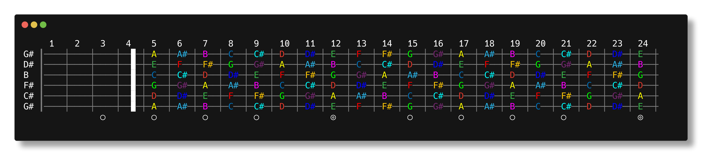
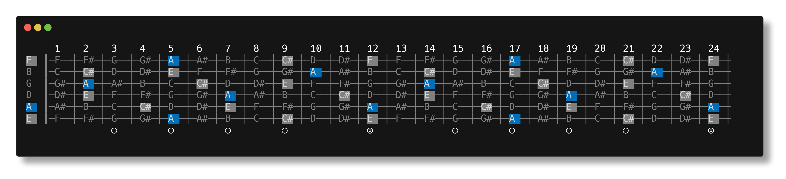

# 🎸 Jimi

A command line utility written in Go to display guitar fretboard, scales and chords in any tuning.

Because I love Go, CLIs and guitar (and Hendrix obviously!)

## Build

[](https://github.com/maximegosselin/jimi/actions/workflows/go.yml)

Jimi does not require any specific package or dependency and can be compiled on Linux, macOS or Windows.

If you do not have Go installed yet, you know [what to do](https://go.dev/dl/).

Just `git clone` this repo and run `go build` in a terminal from the root directory.

## Usage

***Note for Windows users:** The Windows Console may not output colored characters properly. You may use PowerShell
instead.*

### Display the fretboard

Standard tuning and no capo.

```
jimi
```


### Complete example

[Open D](https://en.wikipedia.org/wiki/Open_D_tuning) tuning, G chord shapes with capo on 5th fret.

```
jimi -t=DADF#AD -r=G -p=triad -c=5
```


### Custom tuning

Specify the string notes with `-t` from the lowest to the highest string.

Jimi accepts both the sharp and flat notation. However, flats are converted to their sharp equivalent.

```
jimi -t=EbAbDbGbBbEb
```


### Put a capo

Specify the fret position with `-c`.

```
jimi -c=4
```



### Display a scale using a preset pattern

Specify the key with `-r` and the scale pattern with `-p`.

Scale preset patterns are:

- `aeolian`
- `dorian`
- `ionian`
- `locrian`
- `lydian`
- `major`
- `major-blues`
- `major-pentatonic`
- `minor`
- `minor-blues`
- `minor-pentatonic`
- `mixolydian`
- `phrygian`

```
jimi -r=G# -p=minor-pentatonic 
```


### Display chord shapes using a preset pattern

Specify the root note with `-r` and the chord pattern with `-p`.

Chord preset patterns are:

- `5th`        
- `aug`        
- `dim`        
- `m7b5`       
- `major-6th`  
- `major-7th`  
- `major-maj7`
- `major-triad`
- `minor-6th`  
- `minor-7th`  
- `minor-maj7`
- `minor-triad`
- `sus`        
- `sus2`       
- `sus4`

```
jimi -r=A -p=major-triad
```



### Display a custom scale or chord shapes using intervals

Specify the root note with `-r` and dash-separated list of intervals with `-p`.

```
jimi -r=C -p=1-3-5-b7
```


## License

The MIT License (MIT). Please see [License File](LICENSE) for more information.

---

> If Jimi Hendrix was a developer, he would have written Foxey Lady in Go, not C#!
